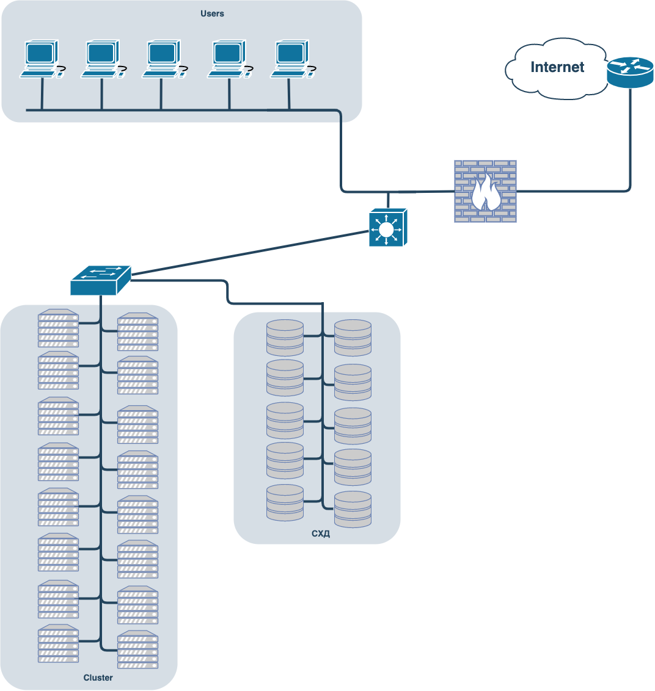

# Домашнее задание к занятию "3.8. Компьютерные сети, лекция 3"

### Цель задания

В результате выполнения этого задания вы:

1. На практике познакомитесь с маршрутизацией в сетях, что позволит понять устройство больших корпоративных сетей и интернета.
2. Проверите TCP/UDP соединения на хосте (это обычный этап отладки сетевых проблем).
3. Построите сетевую диаграмму.

### Чеклист готовности к домашнему заданию

1. Убедитесь, что у вас установлен `telnet`.
2. Воспользуйтесь пакетным менеджером apt для установки.


### Инструкция к заданию

1. Создайте .md-файл для ответов на задания в своём репозитории, после выполнения прикрепите ссылку на него в личном кабинете.
2. Любые вопросы по выполнению заданий спрашивайте в чате учебной группы и/или в разделе “Вопросы по заданию” в личном кабинете.


### Инструменты/ дополнительные материалы, которые пригодятся для выполнения задания

1. [Зачем нужны dummy интерфейсы](https://tldp.org/LDP/nag/node72.html)

------

## Задание

1. Подключитесь к публичному маршрутизатору в интернет. Найдите маршрут к вашему публичному IP
```
telnet route-views.routeviews.org
Username: rviews
show ip route x.x.x.x/32
show bgp x.x.x.x/32
```

<details>
<summary>Ответ</summary>

    telnet route-views.routeviews.org
    Username: rviews
    
    route-views>show ip route 92.255.211.2
    Routing entry for 92.255.208.0/22
      Known via "bgp 6447", distance 20, metric 0
      Tag 3267, type external
      Last update from 194.85.40.15 14:49:30 ago
      Routing Descriptor Blocks:
      * 194.85.40.15, from 194.85.40.15, 14:49:30 ago
          Route metric is 0, traffic share count is 1
          AS Hops 3
          Route tag 3267
          MPLS label: none
    
    route-views>show bgp 92.255.211.2        
    BGP routing table entry for 92.255.208.0/22, version 2797107761
    Paths: (20 available, best #6, table default)
      Not advertised to any peer
      Refresh Epoch 1
      20912 3257 1299 9049 52207
        212.66.96.126 from 212.66.96.126 (212.66.96.126)
          Origin IGP, localpref 100, valid, external
          Community: 3257:8066 3257:30055 3257:50001 3257:53900 3257:53902 20912:65004
          path 7FE0AC395670 RPKI State not found
          rx pathid: 0, tx pathid: 0
      Refresh Epoch 1
      3549 3356 9002 9002 9002 9002 9002 9049 52207
        208.51.134.254 from 208.51.134.254 (67.16.168.191)
          Origin IGP, metric 0, localpref 100, valid, external
          Community: 3356:2 3356:22 3356:100 3356:123 3356:503 3356:903 3356:2067 3549:2581 3549:30840
          path 7FE15CC8D4A0 RPKI State not found
          rx pathid: 0, tx pathid: 0

</details>

2. Создайте dummy0 интерфейс в Ubuntu. Добавьте несколько статических маршрутов. Проверьте таблицу маршрутизации.

<details>
<summary>Ответ</summary>

    Загружаем модуль «dummy», можно также добавить опцию «numdummies=2» чтобы сразу создалось два интерфейса dummyX:
    # modprobe -v dummy numdummies=1

    Проверяем загрузился ли модуль:
    # lsmod | grep dummy

    Проверка созданных интерфейсов:
    # ifconfig -a
    dummy0: flags=130<BROADCAST,NOARP>  mtu 1500
    ether 86:62:23:b5:7f:94  txqueuelen 1000  (Ethernet)
    RX packets 0  bytes 0 (0.0 B)
    RX errors 0  dropped 0  overruns 0  frame 0
    TX packets 0  bytes 0 (0.0 B)
    TX errors 0  dropped 0 overruns 0  carrier 0  collisions 0
    ...

    Настройка автозапуска при старте системы:
    echo "dummy" >> /etc/modules

    Добавление IP адреса для интерфейса dummy0:
    ip addr add 192.168.1.150/24 dev dummy0

    # ifconfig -a
    dummy0: flags=130<BROADCAST,NOARP>  mtu 1500
    inet 192.168.1.150  netmask 255.255.255.0  broadcast 0.0.0.0
    ether 86:62:23:b5:7f:94  txqueuelen 1000  (Ethernet)
    RX packets 0  bytes 0 (0.0 B)
    RX errors 0  dropped 0  overruns 0  frame 0
    TX packets 0  bytes 0 (0.0 B)
    TX errors 0  dropped 0 overruns 0  carrier 0  collisions 0

    Таблица маршрутизации до запуска и добавления маршрута:
    # ip -br route
    default via 10.0.2.2 dev eth0 proto dhcp src 10.0.2.15 metric 100 
    10.0.2.0/24 dev eth0 proto kernel scope link src 10.0.2.15 
    10.0.2.2 dev eth0 proto dhcp scope link src 10.0.2.15 metric 100

    Запускаем сетевой интерфейс:
    # ifconfig dummy0 up

    Добавление статического маршрута:
    # ip route add 172.16.10.0/24 dev dummy0

    Таблица маршрутизации после запуска и добавления маршрута:
    # ip -br route
    default via 10.0.2.2 dev eth0 proto dhcp src 10.0.2.15 metric 100 
    10.0.2.0/24 dev eth0 proto kernel scope link src 10.0.2.15 
    10.0.2.2 dev eth0 proto dhcp scope link src 10.0.2.15 metric 100 
    172.16.10.0/24 dev dummy0 scope link 
    192.168.1.0/24 dev dummy0 proto kernel scope link src 192.168.1.150

</details>

3. Проверьте открытые TCP порты в Ubuntu, какие протоколы и приложения используют эти порты? Приведите несколько примеров.

<details>
<summary>Ответ</summary>

    # netstat -aptn
    Active Internet connections (servers and established)
    Proto Recv-Q Send-Q Local Address           Foreign Address         State       PID/Program name    
    tcp        0      0 127.0.0.53:53           0.0.0.0:*               LISTEN      656/systemd-resolve 
    tcp        0      0 0.0.0.0:22              0.0.0.0:*               LISTEN      945/sshd: /usr/sbin 
    tcp        0      0 10.0.2.15:22            10.0.2.2:55923          ESTABLISHED 7402/sshd: vagrant  
    tcp6       0      0 :::22                   :::*                    LISTEN      945/sshd: /usr/sbin 

    или

    # ss -aptn
    State             Recv-Q            Send-Q                       Local Address:Port                       Peer Address:Port             Process
    LISTEN            0                 4096                         127.0.0.53%lo:53                              0.0.0.0:*                 users:(("systemd-resolve",pid=656,fd=13))
    LISTEN            0                 128                                0.0.0.0:22                              0.0.0.0:*                 users:(("sshd",pid=945,fd=3))
    ESTAB             0                 0                                10.0.2.15:22                             10.0.2.2:55923             users:(("sshd",pid=7566,fd=4),("sshd",pid=7402,fd=4))
    LISTEN            0                 128                                   [::]:22                                 [::]:*                 users:(("sshd",pid=945,fd= 4))

</details>

4. Проверьте используемые UDP сокеты в Ubuntu, какие протоколы и приложения используют эти порты?

<details>
<summary>Ответ</summary>

    # netstat -ua
    Active Internet connections (servers and established)
    Proto Recv-Q Send-Q Local Address           Foreign Address         State      
    udp        0      0 localhost:domain        0.0.0.0:*                          
    udp        0      0 vagrant:bootpc          0.0.0.0:*      
    
    или
    
    # ss -ua
    State                  Recv-Q                  Send-Q                                    Local Address:Port                                     Peer Address:Port                 Process
    UNCONN                 0                       0                                         127.0.0.53%lo:domain                                        0.0.0.0:*
    UNCONN                 0                       0                                        10.0.2.15%eth0:bootpc                                        0.0.0.0:*

</details>

5. Используя diagrams.net, создайте L3 диаграмму вашей домашней сети или любой другой сети, с которой вы работали. 

<details>
<summary>Ответ</summary>

    
    
    
    
    
    

</details>


*В качестве решения ответьте на вопросы, опишите, каким образом эти ответы были получены и приложите по неоходимости скриншоты*

 ---
 
## Задание для самостоятельной отработки* (необязательно к выполнению)

6. Установите Nginx, настройте в режиме балансировщика TCP или UDP.

7. Установите bird2, настройте динамический протокол маршрутизации RIP.

8. Установите Netbox, создайте несколько IP префиксов, используя curl проверьте работу API.

----

### Правила приема домашнего задания

В личном кабинете отправлена ссылка на .md файл в вашем репозитории.

-----

### Критерии оценки

Зачет - выполнены все задания, ответы даны в развернутой форме, приложены соответствующие скриншоты и файлы проекта, в выполненных заданиях нет противоречий и нарушения логики.

На доработку - задание выполнено частично или не выполнено, в логике выполнения заданий есть противоречия, существенные недостатки. 
 
Обязательными к выполнению являются задачи без указания звездочки. Их выполнение необходимо для получения зачета и диплома о профессиональной переподготовке.
Задачи со звездочкой (*) являются дополнительными задачами и/или задачами повышенной сложности. Они не являются обязательными к выполнению, но помогут вам глубже понять тему.
